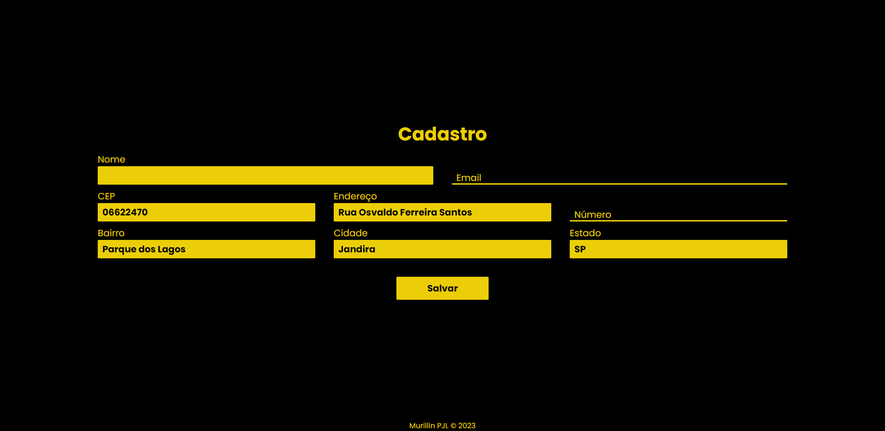

# CONSUMO DA API VIACEP

---

## Sobre o projeto

Aplicação feita em Javascript puro (vanilla.JS), para consumir a API publica da VIACEP, que retorna informações de um CEP.
Para isso criamos um formulário de cadastro, que preenche automaticamente os campos de endereço, bairro, cidade e estado.

---
## Tecnologias utilizadas
 - HTML
 - CSS
 - JAVASCRIPT
 - FETCH
 - ASYNC / AWAIT
 - REGEX
 - [VIACEP](https://viacep.com.br/)

 ---

